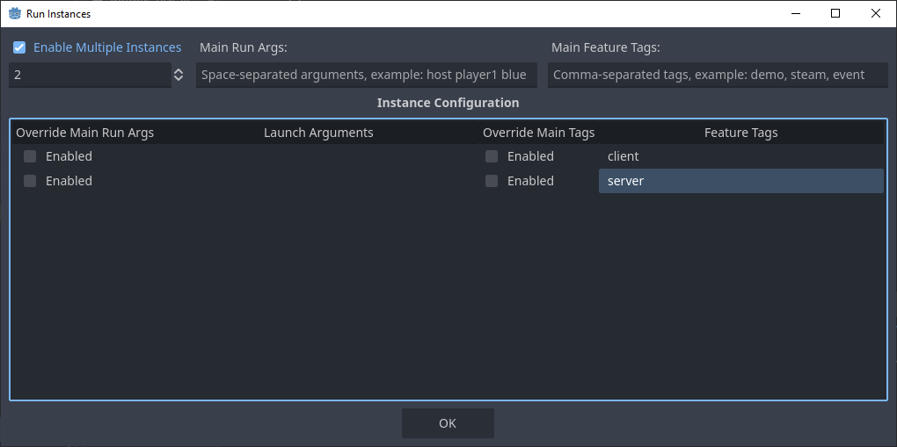
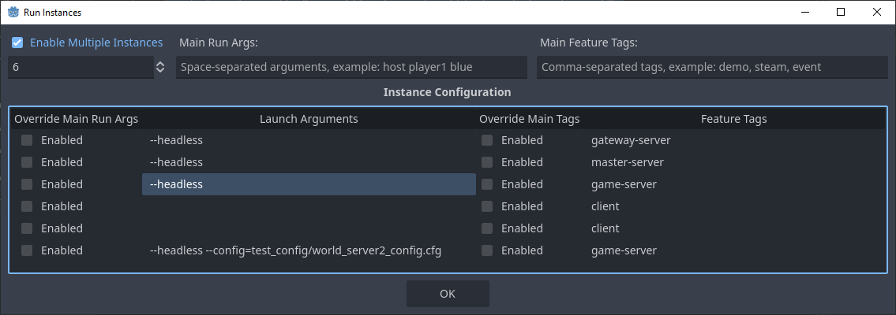

## Customize Run Instances

> [!NOTE]
> General Godot 4 knowledge which can be useful for any project.

This Godot 4 feature allows you to run multiple different instances of the project at once, and the most interesting aspect is that you can set specific launch arguments and feature tags for each instance.

It can be helpful for various purposes, but for multiplayer projects, it’s especially useful to run a server and multiple clients at once from the same Godot editor in one click.

In a small-scale project, we can simply use two feature tags to determine whether an instance should start as a client or a server.

Here’s a simple example in the "Run Instances" window, which you can access at `Debug` → `Customize Run Instances...`:


And how it could be used in code:
```gdscript
func _ready() -> void:
	if OS.has_feature("client"):
		start_as_client()
	elif OS.has_feature("server"):
		start_as_server()
```

## Feature Tags
In Godot Tiny MMO, we use feature tags to decide if the project is a world server, gateway server, master server, or client.

The tags for this project are:
- **client**
- **gateway-server**
- **master-server**
- **world-server**

These tags are used in `source/common/main.gd` as follows:
```gdscript
func _ready() -> void:
	if OS.has_feature("client"):
		start_as_client()
	elif OS.has_feature("world-server"):
		start_as_world_server()
	elif OS.has_feature("gateway-server"):
		start_as_gateway_server()
	elif OS.has_feature("master-server"):
		start_as_master_server()

func start_as_client() -> void:
	get_tree().change_scene_to_file.call_deferred("res://source/client/client_main.tscn")
...
```

## Launch Arguments

We also use these launch arguments:
- **--headless**: Runs the project without window and audio.  
  Enabling headless mode is equivalent to `--display-driver headless --audio-driver Dummy`. 
- **--config**: Specifies a custom config path.  
  Usage example: `--config="config/gateway_config.cfg"`  
  Config files are used to set networking information, such as certificate paths, ports, and addresses.  
  Default configuration files are located in `test_config/`.

Example `gateway_config.cfg` file:
```ini
; Example of gateway_config.cfg file.
[gateway-server]
port=8088
certificate_path="res://test_config/tls/certificate.crt"
key_path="res://test_config/tls/key.key"

[gateway-manager-client]
port=8064
address="127.0.0.1"
certificate_path="res://test_config/tls/certificate.crt"
```

Here’s an example of how to use this feature,  
one world-server using the default configuration,
and the other one using a specific one:


### Links

- [Official documentation](https://docs.godotengine.org/en/stable/tutorials/scripting/debug/overview_of_debugging_tools.html#customize-run-instances) on the "Customize Run Instances..." feature.  
- [Official documentation](https://docs.godotengine.org/en/stable/tutorials/editor/command_line_tutorial.html#command-line-reference) on general command line references and launch argument options.
